# Bifrost-API 🌈

**Bifrost-API** is a comprehensive download management system that provides REST APIs for managing and scheduling software dependency downloads. Built with Kotlin and Spring Boot, it serves as the central orchestrator for the Bifrost ecosystem.

## 🔒 Secure Download System for Air-Gapped Enterprises

Bifrost is a **secure download system** specifically designed with **air-gapped enterprises** in mind. It enables organizations to safely manage software dependencies across security boundaries while maintaining strict network isolation.

### 🏢 Enterprise Security Scenarios

The Bifrost ecosystem supports multiple deployment scenarios for different security requirements:

#### **Scenario 1: Complete Low-Side Deployment**
- **All components** (Bifrost-API, Bifrost, Bifrost-Minion) deployed on the low-side network
- **One-way data transfer** to high-side through secure channels
- Downloads processed on low-side, then securely transferred to air-gapped environment

#### **Scenario 2: Minion-Only Low-Side**
- **Bifrost-API & Bifrost** on high-side (air-gapped network)
- **Bifrost-Minion** workers on low-side with internet access
- Secure message queuing enables controlled download operations

#### **Scenario 3: Hybrid Configuration**
- Flexible deployment based on specific security policies
- Components can be distributed across security zones as needed
- **NiFi + RabbitMQ** architecture enables all scenarios seamlessly

### 🌉 Bridging Security Boundaries

The system leverages **Apache NiFi** and **RabbitMQ** to create secure, auditable data flows:
- **Message-driven architecture** ensures loose coupling across security boundaries
- **Queue-based communication** allows for asynchronous, controlled data transfer
- **Audit trails** for all download activities and security compliance
- **Configurable security policies** for different classification levels

## 🏗️ Architecture Overview

Bifrost-API is part of a distributed system consisting of three main components:

- **[Bifrost-API](https://github.com/SPJDevOps/vardr-Bifrost-API)** (This repository) - REST API and scheduling system
- **[Bifrost](https://github.com/SPJDevOps/vardr-Bifrost)** - Main processing engine and download orchestrator
- **[Bifrost-Minion](https://github.com/SPJDevOps/vardr-Bifrost-Minion)** - Worker nodes that perform actual downloads

```mermaid
graph TB
    subgraph "High-Side (Air-Gapped)"
        A[React Frontend]
        B[Bifrost-API]
        C[PostgreSQL]
        I[Apache NiFi<br/>Data Flows]
    end
    
    subgraph "Security Boundary"
        D[RabbitMQ<br/>Message Queue]
        J[Secure Transfer<br/>Mechanism]
    end
    
    subgraph "Low-Side (Internet Access)"
        E[Bifrost<br/>Orchestrator]
        F[Bifrost-Minion 1<br/>Download Worker]
        G[Bifrost-Minion 2<br/>Download Worker]
        H[Bifrost-Minion N...<br/>Download Worker]
        K[External Repositories<br/>Maven, NPM, PyPI, etc.]
    end
    
    A --> B
    B --> C
    B --> D
    D --> E
    E --> F
    E --> G
    E --> H
    F --> K
    G --> K
    H --> K
    
    D -.->|Secure Channel| J
    J -.->|One-way Transfer| I
    I -.->|Processed Data| B
    
    style A fill:#61dafb
    style B fill:#6db33f
    style C fill:#336791
    style D fill:#ff6600
    style E fill:#f39c12
    style F fill:#e74c3c
    style G fill:#e74c3c
    style H fill:#e74c3c
    style I fill:#9b59b6
    style J fill:#34495e
    style K fill:#95a5a6
```



## 🚀 Features

### Core Download Management
- **On-demand Downloads**: Trigger immediate downloads via REST API
- **Download Status Tracking**: Real-time status updates through RabbitMQ
- **User Authentication**: JWT-based authentication with Keycloak integration
- **Download History**: Complete audit trail of all download activities

### Advanced Scheduling System
- **Multiple Schedule Types**:
  - One-time execution
  - Daily at specific time
  - Weekly on specific days
  - Monthly on specific dates
  - First/Last day of month
  - Custom intervals (hours/days/minutes)
  - Cron expressions (extensible)

### Security & Multi-tenancy
- **JWT Authentication**: Secure API access with Keycloak
- **User Isolation**: Users can only access their own downloads and schedules
- **Role-based Access**: Admin endpoints for system-wide monitoring
- **CORS Support**: Configured for modern web applications

### Enterprise Security Features
- **Air-Gap Compatibility**: Designed for classified and restricted environments
- **Audit Logging**: Complete audit trail for compliance and security reviews
- **Secure Transfer Mechanisms**: Support for one-way data diodes and secure file transfers
- **Network Isolation**: Components can be deployed across different security zones
- **Apache NiFi Integration**: Secure, auditable data flow management
- **Message Queue Security**: Encrypted communication channels between components
- **Classification Handling**: Configurable security policies for different data classifications

### API Features
- **RESTful Design**: Clean, intuitive API endpoints
- **Pagination**: Efficient handling of large datasets
- **Error Handling**: Comprehensive error responses
- **OpenAPI Documentation**: Auto-generated API documentation

## 🛠️ Technology Stack

- **Framework**: Spring Boot 3.3.4
- **Language**: Kotlin 1.9.25
- **Database**: PostgreSQL
- **Message Queue**: RabbitMQ
- **Authentication**: Spring Security + OAuth2 Resource Server
- **Build Tool**: Gradle with Kotlin DSL
- **Containerization**: Docker & Docker Compose

## 📋 Prerequisites

Before running Bifrost-API, ensure you have:

1. **Java 17+** installed
2. **Docker & Docker Compose** for infrastructure
3. **Keycloak instance** running and configured
4. **[Bifrost](https://github.com/your-org/bifrost)** - Main processing engine
5. **[Bifrost-Minion](https://github.com/your-org/bifrost-minion)** - At least one worker node

## 🚀 Quick Start

### 1. Clone the Repository
```bash
git clone https://github.com/your-org/bifrost-api.git
cd bifrost-api
```

### 2. Start Infrastructure Services
```bash
docker-compose up -d
```

This starts:
- PostgreSQL database
- RabbitMQ message broker
- Keycloak (if included in docker-compose)

### 3. Configure Keycloak
Update `src/main/resources/application.properties`:

```properties
# Update these values to match your Keycloak instance
spring.security.oauth2.resourceserver.jwt.issuer-uri=http://localhost:8080/realms/your-realm-name
spring.security.oauth2.resourceserver.jwt.jwk-set-uri=http://localhost:8080/realms/your-realm-name/protocol/openid-connect/certs
```

### 4. Run the Application
```bash
./gradlew bootRun
```

The API will be available at `http://localhost:8080`

### 5. Start Dependent Services
Ensure you have the following services running:
- **Bifrost**: Main processing engine that consumes download requests
- **Bifrost-Minion**: Worker nodes that perform actual downloads

## 📚 API Documentation

### Authentication Endpoints
```http
GET  /auth/me          # Get current user info
GET  /auth/status      # Get authentication status
```

### Download Management
```http
GET  /downloads        # Get user's downloads (paginated)
POST /downloads        # Create new download request
```

### Schedule Management
```http
GET  /schedules        # Get user's schedules (paginated)
POST /schedules        # Create new schedule
GET  /schedules/{id}   # Get specific schedule
PUT  /schedules/{id}/toggle  # Enable/disable schedule
DELETE /schedules/{id} # Delete schedule
GET  /schedules/types  # Get available schedule types
```

### Admin Endpoints
```http
GET /schedules/all     # Get all schedules (admin only)
GET /schedules/active  # Get all active schedules (admin only)
```

## 💾 Database Schema

### Core Tables
- **hyperloop_download**: Download records and status
- **download_schedule**: Scheduled download configurations

### Key Relationships
- Downloads can be linked to schedules via `schedule_id`
- All records are associated with users via `user_id`

## 🔧 Configuration

### Application Properties
Key configuration options in `application.properties`:

```properties
# Database
spring.datasource.url=jdbc:postgresql://localhost:5432/hyperloop
spring.datasource.username=spring
spring.datasource.password=boot

# RabbitMQ
spring.rabbitmq.host=localhost
spring.rabbitmq.port=5672
spring.rabbitmq.request-queue.routing-key=private.hyperloop.download_requests
spring.rabbitmq.status-queue.routing-key=private.hyperloop.download_status

# JWT Authentication
spring.security.oauth2.resourceserver.jwt.issuer-uri=http://localhost:8080/realms/your-realm
spring.security.oauth2.resourceserver.jwt.jwk-set-uri=http://localhost:8080/realms/your-realm/protocol/openid-connect/certs
```

## 🐳 Docker Deployment

### Using Docker Compose
```bash
# Start all services
docker-compose up -d

# View logs
docker-compose logs -f bifrost-api

# Stop services
docker-compose down
```

### Building Docker Image
```bash
./gradlew bootJar
docker build -t bifrost-api .
```

## 🔒 Security

### Authentication Flow
1. User authenticates with Keycloak through frontend
2. Frontend receives JWT token
3. API requests include `Authorization: Bearer <token>` header
4. Spring Security validates JWT and extracts user info

### Authorization
- **User Isolation**: Users can only access their own data
- **Admin Access**: Special endpoints require `ADMIN` role
- **CORS**: Configured for cross-origin requests from frontend

## 🧪 Testing

### Run Tests
```bash
./gradlew test
```

### Test with Authentication
For API testing, you'll need a valid JWT token from your Keycloak instance:

```bash
curl -H "Authorization: Bearer YOUR_JWT_TOKEN" \
     http://localhost:8080/downloads
```

## 📈 Monitoring

### Health Checks
- **Application Health**: `GET /actuator/health`
- **Database Health**: Included in health check
- **RabbitMQ Health**: Included in health check

### Logging
The application uses structured logging with configurable levels:
- Download execution events
- Schedule processing
- Authentication events
- Error conditions

## 🏭 Deployment Scenarios

### Air-Gapped Enterprise Deployments

#### **Complete Low-Side Setup**
```bash
# Deploy all components on low-side network
# Data transferred to high-side via secure mechanisms
Low-Side: [Bifrost-API] → [Bifrost] → [Bifrost-Minions] → [Internet]
High-Side: [Secure Transfer] → [Processed Downloads]
```

#### **Minion-Only Low-Side**
```bash
# API and orchestrator on high-side, workers on low-side
High-Side: [Bifrost-API] → [RabbitMQ Bridge] 
Low-Side: [RabbitMQ] → [Bifrost] → [Bifrost-Minions] → [Internet]
```

#### **Hybrid Configuration**
- Components distributed based on security policies
- NiFi flows handle secure data transfer between zones
- RabbitMQ enables asynchronous communication across boundaries

### NiFi + RabbitMQ Architecture Benefits
- **Flexible Deployment**: Supports all security scenarios
- **Audit Compliance**: Complete data lineage and audit trails
- **Secure Transfer**: Encrypted, authenticated message flows
- **Scalability**: Horizontal scaling of download workers
- **Resilience**: Queue-based architecture handles network interruptions

## 🤝 Integration with Bifrost Ecosystem

### Secure Message Flow
1. **Bifrost-API** receives download request from authenticated user
2. Request saved to database with full audit trail
3. Message published to RabbitMQ with security context
4. **Apache NiFi** processes and routes messages based on security policies
5. **Bifrost** consumes message and orchestrates download across security boundaries
6. **Bifrost-Minion** performs actual download with proper isolation
7. Status updates flow back through secure channels to **Bifrost-API**
8. All activities logged for compliance and security review

### Required Services
Before starting Bifrost-API, ensure these services are running:

1. **Bifrost** - Main processing engine
   ```bash
   git clone https://github.com/SPJDevOps/vardr-Bifrost.git
   cd vardr-Bifrost
   # Follow Bifrost setup instructions
   ```

2. **Bifrost-Minion** - Worker nodes
   ```bash
   git clone https://github.com/SPJDevOps/vardr-Bifrost-Minion.git
   cd vardr-Bifrost-Minion
   # Follow Bifrost-Minion setup instructions
   ```

3. **Apache NiFi** - Data flow management (included in docker-compose)
4. **RabbitMQ** - Message queue (included in docker-compose)
5. **PostgreSQL** - Database (included in docker-compose)

## 🚧 Development

### Project Structure
```
src/
├── main/kotlin/com/example/hyperloop/
│   ├── downloads/          # Download management
│   ├── scheduling/         # Scheduling system
│   ├── security/          # Authentication & authorization
│   ├── queues/           # RabbitMQ integration
│   └── exceptions/       # Custom exceptions
└── main/resources/
    ├── application.properties
    └── static/
```

### Adding New Features
1. Create feature branch: `git checkout -b feature/new-feature`
2. Implement changes with tests
3. Update documentation
4. Create pull request

## 🐛 Troubleshooting

### Common Issues

**Authentication Failures**
- Verify Keycloak is running and accessible
- Check JWT issuer URI configuration
- Ensure realm and client settings are correct

**Database Connection Issues**
- Verify PostgreSQL is running
- Check connection parameters
- Ensure database schema is up to date

**RabbitMQ Connection Issues**
- Verify RabbitMQ is running
- Check queue configurations
- Ensure Bifrost services are consuming messages

### Debug Mode
Enable debug logging:
```properties
logging.level.com.example.hyperloop=DEBUG
logging.level.org.springframework.security=DEBUG
```

## 📄 License

This project is licensed under the MIT License - see the [LICENSE](LICENSE) file for details.

## 🤝 Contributing

1. Fork the repository
2. Create a feature branch
3. Make your changes
4. Add tests for new functionality
5. Ensure all tests pass
6. Create a pull request

## 📞 Support

- **Issues**: [GitHub Issues](https://github.com/your-org/bifrost-api/issues)
- **Documentation**: [Wiki](https://github.com/your-org/bifrost-api/wiki)
- **Discussions**: [GitHub Discussions](https://github.com/your-org/bifrost-api/discussions)

---

**⚠️ Important**: Bifrost-API is part of a **secure download ecosystem** designed for air-gapped enterprises. For the complete setup, you also need to run [Bifrost](https://github.com/SPJDevOps/vardr-Bifrost) and [Bifrost-Minion](https://github.com/SPJDevOps/vardr-Bifrost-Minion) services.

The NiFi + RabbitMQ architecture enables flexible deployment across security boundaries, making it ideal for organizations with strict network isolation requirements.
